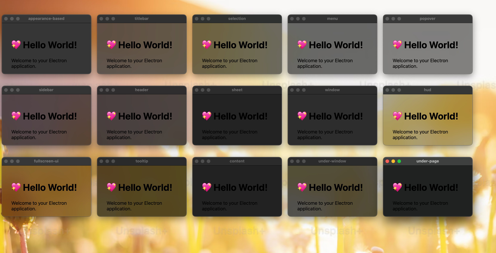

# electron vibrancy gallery

This is a gallery of electron vibrancy effects. It is a collection of screenshots and videos of electron apps with vibrancy effects.

Execute `yarn install` to install the dependencies and `yarn start` to start the gallery, it will create several windows with different vibrancy effects.

Corresponding code: https://github.com/electron/electron/blob/04df5ce492f61fd67912fc8bc0cd6a064618f231/shell/browser/native_window_mac.mm#L1428-L1457
